# AI-powered Research Assistant

A simple yet effective research agent that is fully under your control. It comes packed with a Web UI, and offers full insight into what it's doing and which sources it's consulting (using OpenTelemetry traces). The agent can browse the web and access local files.

Built with [Generative AI Toolkit](https://github.com/awslabs/generative-ai-toolkit/) and [Gradio](https://www.gradio.app/).

## Example Use Cases

- Research technical topics with information from many sources
- Explore GitHub repositories
- Review GitHub pull requests
- Review local code repositories
- Analyze (and fix) bugs; not just your own, feel free to make it analyze (perceived) bugs in your dependencies too. The agent will happily dig through their source code on GitHub

## Chat UI

You can chat with the agent using the UI:


Expand the subagent to see all the web URLs it consulted:


Expand the tool invocation to see exactly what the tool returned to the agent:


The [Gradio](https://www.gradio.app/) based UI is perfectly capable of rendering Markdown with mermaid diagrams or images:


## Multi-agent approach

The agent consists of a supervisor agent that is great in coding itself, has a think tool to help it think, and can hand off tasks to its subagents:

```mermaid
graph TD
    User[👤 User] --> UI[🖥️ Gradio Chat UI]
    UI --> Orchestrator[🎯 Orchestrator Agent]

    Orchestrator --> Think[🧠 think]
    Orchestrator -.-> FilesAgent[📁 Local Files Agent]
    Orchestrator -.-> WebAgent[🌐 Web Research Agent]

    WebAgent --> WebSearch[🔍 web_search]
    WebAgent --> FetchHTML[📄 fetch_html]
    WebAgent --> GitHubFile[📂 fetch_github_file]
    WebAgent --> GitHubFolder[📂 list_github_folder]
    WebAgent --> GitHubNotebook[📓 fetch_github_notebook]
    WebAgent --> PRData[🔀 fetch_pr_data_yaml]

    FilesAgent --> WriteFile[✏️ write_file]
    FilesAgent --> ReadFile[📖 read_file]
    FilesAgent --> ListDir[📋 list_dir]
    FilesAgent --> GitTree[🌳 get_git_tracked_tree]

    %% Styling for better contrast in both light and dark modes
    classDef agentClass fill:#4a90e2,color:#ffffff,stroke:#2c5282,stroke-width:2px
    classDef toolClass fill:#e2e8f0,color:#2d3748,stroke:#4a5568,stroke-width:1px

    class Orchestrator,WebAgent,FilesAgent agentClass
    class Think,WebSearch,FetchHTML,GitHubFile,GitHubFolder,GitHubNotebook,PRData,WriteFile,ReadFile,ListDir,GitTree toolClass
```



## Requirements

- Python 3.13+
- [Uv](https://github.com/astral-sh/uv) (Python package installer, recommended)
- Amazon Bedrock and Amazon DynamoDB
  - Amazon Bedrock for access to a Large Language Model (see exact model used in [main.py](./main.py))
  - Amazon DynamoDB for storing conversation history and traces
- Brave Search API key
  - You can use the default Brave search plan, which requires a CC registered but is free of charge
- GitHub token

## Installation

```shell
# Clone this repository
git clone https://github.com/ottokruse/research-agent.git
cd research-agent

# Create a virtual env
uv venv
source .venv/bin/activate

# Install dependencies
uv pip install -r requirements.txt
```

## DynamoDB

Conversation history and traces are stored in a DynamoDB table.

Create this table as follows:

```shell
aws dynamodb create-table \
  --table-name research-agent \
  --attribute-definitions \
    AttributeName=pk,AttributeType=S \
    AttributeName=sk,AttributeType=S \
    AttributeName=conversation_id,AttributeType=S \
  --key-schema \
    AttributeName=pk,KeyType=HASH \
    AttributeName=sk,KeyType=RANGE \
  --billing-mode PAY_PER_REQUEST \
  --global-secondary-indexes '[{"IndexName":"by_conversation_id","KeySchema":[{"AttributeName":"conversation_id","KeyType":"HASH"},{"AttributeName":"sk","KeyType":"RANGE"}],"Projection":{"ProjectionType":"ALL"}}]'
```

## Environment

Populate your Brave Search API key and GitHub token into the environment:

```shell
export BRAVE_SEARCH_API_KEY=your_brave_search_api_key_here
export GITHUB_TOKEN=your_github_token_here
```

Ensure you have valid AWS credentials in the usual place where boto3 can find them, for example:

```shell
export AWS_PROFILE=your-profile
```

Or, of course:

```shell
export AWS_ACCESS_KEY_ID=...
export AWS_SECRET_ACCESS_KEY=...
export AWS_SESSION_TOKEN=...
```

## Usage

```shell
# Run the research agent
uv run python main.py
```

That will spawn a web ui (see screenshot above) and open your browser so you can enter your questions or research tasks.

## Shell alias

Add this to your .zshrc so you can quickly spawn the UI with `qq`:

```shell
alias qq="AWS_PROFILE=<profile> AWS_ACCESS_KEY_ID= AWS_SECRET_ACCESS_KEY= AWS_SESSION_TOKEN= GITHUB_TOKEN=<token> BRAVE_SEARCH_API_KEY=<key> /<path>/<to>/research-agent/main.sh"
```
