# AI-powered Research Assistant

A simple yet effective research agent that is fully under your control. It comes packed with a Web UI, and offers full insight into what it's doing and which sources it's consulting (using OpenTelemetry traces). The agent can browse the web, analyze GitHub repositories and review GitHub PRs, and access local files.

Built with [Generative AI Toolkit](https://github.com/awslabs/generative-ai-toolkit/) and [Gradio](https://www.gradio.app/).

## Example Use Cases

- Research technical topics with information from many sources
- Explore GitHub repositories
- Review GitHub pull requests
- Review local code repositories
- Analyze (and fix) bugs; not just your own, feel free to make it analyze (perceived) bugs in your dependencies too. The agent will happily dig through their source code on GitHub
- Understand how to use poorly documented open-source solutions. The agent will happily dig through their source code on GitHub.

## Chat UI

You command the agent using the chat UI (best use **_Chrome_**! FireFox doesn't like chats with a lot of messages):


## Multi-agent approach

The agent consists of a supervisor agent that is great in coding itself, and can hand off tasks to its subagents:

```mermaid
graph TD
    User[👤 User] --> UI[🖥️ Gradio Chat UI]
    UI --> Orchestrator[🎯 Orchestrator Agent]

    Orchestrator --> Think[🧠 think]
    Orchestrator --> WriteFile[✏️ write_file]
    Orchestrator --> ReadFile[📖 read_file]
    Orchestrator -.-> FilesAgent[📁 Local Files Agent]
    Orchestrator -.-> WebAgent[🌐 Web Research Agent]

    WebAgent --> WebSearch[🔍 web_search]
    WebAgent --> FetchHTML[📄 fetch_html]
    WebAgent --> FetchGitHubFile[📂 fetch_github_file]
    WebAgent --> ListGitHubFolder[📂 list_github_folder]
    WebAgent --> FetchGitHubNotebook[📓 fetch_github_notebook]
    WebAgent --> FetchPRDataYaml[🔀 fetch_pr_data_yaml]

    FilesAgent --> WriteFileLocal[✏️ write_file]
    FilesAgent --> ReadFileLocal[📖 read_file]
    FilesAgent --> ListDir[📋 list_dir]
    FilesAgent --> GitTree[🌳 get_git_tracked_tree]
    FilesAgent --> InspectGitChanges[🔍 inspect_git_changes]

    %% Styling for better contrast in both light and dark modes
    classDef agentClass fill:#4a90e2,color:#ffffff,stroke:#2c5282,stroke-width:2px
    classDef toolClass fill:#e2e8f0,color:#2d3748,stroke:#4a5568,stroke-width:1px

    class Orchestrator,WebAgent,FilesAgent agentClass
    class Think,WebSearch,FetchHTML,FetchGitHubFile,ListGitHubFolder,FetchGitHubNotebook,FetchPRDataYaml,WriteFile,ReadFile,WriteFileLocal,ReadFileLocal,ListDir,GitTree,InspectGitChanges toolClass
```



## Screen shots


Expand the subagent to see all the web URLs it consulted:


Expand the tool invocation to see exactly what the tool returned to the agent:


The [Gradio](https://www.gradio.app/) based UI is perfectly capable of rendering Markdown with mermaid diagrams or images:


## Requirements

- Python 3.13+
- [Uv](https://github.com/astral-sh/uv) (Python package installer, recommended)
- Amazon Bedrock access for Large Language Model access (currently using Claude Sonnet 4.5; switching to [one of the other models supported by Amazon Bedrock](https://docs.aws.amazon.com/bedrock/latest/userguide/models-supported.html) just requires a one line change [here](/main.py))
- Brave Search API key
  - You can use the default Brave search plan, which requires a CC registered but is free of charge
- GitHub token
- **Optional**: Amazon DynamoDB for persistent conversation history and traces
  - If not configured, the agent will use SQLite for local storage

## Installation

```shell
# Clone this repository
git clone https://github.com/ottokruse/research-agent.git
cd research-agent

# Create a virtual env
uv venv
source .venv/bin/activate

# Install dependencies
uv pip install -r requirements.txt
```

## Storage Options

The agent supports two storage backends for conversation history and traces:

### Option 1: DynamoDB (Recommended for production)

Create a DynamoDB table as follows:

```shell
aws dynamodb create-table \
  --table-name research-agent \
  --attribute-definitions \
    AttributeName=pk,AttributeType=S \
    AttributeName=sk,AttributeType=S \
    AttributeName=conversation_id,AttributeType=S \
    AttributeName=updated_at,AttributeType=S \
  --key-schema \
    AttributeName=pk,KeyType=HASH \
    AttributeName=sk,KeyType=RANGE \
  --billing-mode PAY_PER_REQUEST \
  --global-secondary-indexes '[{"IndexName":"by_conversation_id","KeySchema":[{"AttributeName":"conversation_id","KeyType":"HASH"},{"AttributeName":"sk","KeyType":"RANGE"}],"Projection":{"ProjectionType":"ALL"}},{"IndexName":"by_updated_at","KeySchema":[{"AttributeName":"pk","KeyType":"HASH"},{"AttributeName":"updated_at","KeyType":"RANGE"}],"Projection":{"ProjectionType":"ALL"}}]'
```

### Option 2: SQLite (Default fallback)

If you don't configure DynamoDB, the agent will automatically use SQLite for local storage. No additional setup required. As you run the agent, you'll see a file `conversations.db` appear in your current working directory.

## Environment

Set up the required environment variables:

```shell
# Required
export BRAVE_SEARCH_API_KEY=your_brave_search_api_key_here
export GITHUB_TOKEN=your_github_token_here

# Optional: For DynamoDB storage (if not set, SQLite will be used)
export RESEARCH_AGENT_DDB_TABLE_NAME=research-agent
```

Ensure you have valid AWS credentials in the usual place where boto3 can find them, for example:

```shell
export AWS_PROFILE=your-profile
```

Or, of course:

```shell
export AWS_ACCESS_KEY_ID=...
export AWS_SECRET_ACCESS_KEY=...
export AWS_SESSION_TOKEN=...
```

## Usage

```shell
# Run the research agent
uv run python main.py
```

That will spawn a web ui (see screenshot above) and open your browser so you can enter your questions or research tasks.

## Shell alias

Add this to your .zshrc so you can quickly spawn the UI with `qq`:

```shell
# With DynamoDB (specify RESEARCH_AGENT_DDB_TABLE_NAME)
alias qq="AWS_PROFILE=<profile> GITHUB_TOKEN=<token> BRAVE_SEARCH_API_KEY=<key> RESEARCH_AGENT_DDB_TABLE_NAME=research-agent /<path>/<to>/research-agent/main.sh"

# With SQLite (local storage)
alias qq="AWS_PROFILE=<profile> GITHUB_TOKEN=<token> BRAVE_SEARCH_API_KEY=<key> /<path>/<to>/research-agent/main.sh"
```
